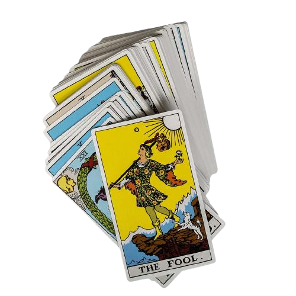

## 1. O que é tarot?
O tarot é um baralho com 78 cartas, chamadas de arcanos, que são divididos em dois grupos: os arcanos maiores (22) e os arcanos menores (56). 

Os arcanos maiores representam arquétipos da sociedade e do imaginário coletivo, representando partes de nós que não podem ser mudadas, como ideias, forças e possibilidades inatas. Ex.: O Papa, A Roda da Fortuna, A Sacerdotisa. 

Já os arcanos menores aparecem para complementar os arcanos maiores e representam especificações e características que podem ser mudadas dentro de uma situação. Eles são bastante conhecidos por quase todo mundo, já que são muito utilizados para jogos recreativos. Ex.: Dois de Paus, Cinco de Ouros, Rainha de Copas. 
## 2. Do que se trata o tarô? 
O tarot é um oráculo que pode auxiliar o consulente (pessoa que se beneficia da leitura) em sua jornada de autoconhecimento. Existem dois tipos de prática no tarot: a divinatória, que consiste em previsões do futuro e a terapêutica, que proporciona uma análise mais a fundo de situações, sem prever o que vai acontecer. 

O tarot considera sempre que as ações moldam o destino, portanto, o livre arbítrio do consulente sempre é levado em conta. Mesmo na modalidade divinatória, a previsão não se trata de uma sentença. Já na modalidade terapêutica, o tarot auxilia na autocompreensão, no autocuidado e na autorreflexão de aspectos da vida. 

## 3. Sobre o projeto.

Este projeto foi desenvolvido em dupla como parte do bootcamp da Laboratoria. Utilizamos as linguagens de programação JavaScript, HTML e CSS com o objetivo de aprender e praticar conceitos como filtros, ordenação de itens, manipulação do DOM e aprimorar o uso de funções e loops.

Durante a realização do projeto, contamos com ferramentas como o VS Code, Node.js, Figma, Git e GitHub para facilitar o desenvolvimento e o versionamento do código. Essas ferramentas nos auxiliaram na criação e organização do projeto, permitindo trabalhar de forma colaborativa e garantindo um controle de versão eficiente.

O foco principal do projeto foi a aplicação dos conceitos de filter, que nos permitiu filtrar e ordenar os itens selecionados, proporcionando uma experiência mais interativa para os usuários. Além disso, também buscamos melhorar nossas habilidades na manipulação do DOM, tornando a interface mais dinâmica e responsiva.

No geral, o projeto foi uma oportunidade de aplicar e consolidar os conhecimentos adquiridos durante o bootcamp, além de nos desafiar a aprimorar nossas habilidades técnicas e de trabalho em equipe.

## 4. Objetivo!
O projeto "Data Lovers" tem como objetivo principal criar uma plataforma dedicada ao mundo do Tarot. Decidimos nomeá-lo de "Busca Espiritual". Desenvolvemos essa página de forma responsiva, garantindo uma experiência consistente em diferentes dispositivos, como tablets, smartphones, iPads e computadores.

A plataforma permite aos usuários apaixonados pelo Tarot visualizar todas as cartas disponíveis. Implementamos filtros por meio de um menu com links para facilitar a navegação. Os filtros incluem opções para arcanos maiores, arcanos menores e baralhos de copas, ouros, paus e espadas. Além disso, incorporamos opções de ordenação alfabética, permitindo que o usuário ordene as cartas de A a Z ou de Z a A.

Para facilitar ainda mais a busca, adicionamos uma caixa de pesquisa. Ao digitar o nome da carta desejada, a carta correspondente é exibida na tela, juntamente com sua imagem e informações relevantes.

Uma funcionalidade interessante que implementamos é o efeito de "flip" ao clicar em qualquer carta. Isso proporciona uma experiência interativa, onde as informações detalhadas da carta são exibidas ao virá-la.

Com o projeto "Busca Espiritual", buscamos criar uma plataforma completa e amigável para os entusiastas do Tarot, oferecendo uma maneira intuitiva de explorar e interagir com as cartas.

## 5.Pontos de aprendizado e funcionalidade do projeto "Busca Espiritual":

Filtro: Aprendemos a utilizar o recurso de filtro para permitir que os usuários selecionem categorias específicas, como arcanos maiores, arcanos menores e diferentes tipos de baralhos. Isso proporciona uma maneira fácil e intuitiva de explorar as cartas de Tarot de acordo com suas preferências.

Ordenação: Implementamos a funcionalidade de ordenação alfabética das cartas, permitindo que os usuários organizem as cartas em ordem crescente (A-Z) ou decrescente (Z-A). Isso facilita a localização de cartas específicas e a navegação pelo conjunto completo de cartas.

Função para cálculo de porcentagem: Desenvolvemos uma função para calcular a porcentagem de cartas exibidas em relação ao número total de cartas disponíveis. Essa funcionalidade fornece aos usuários uma visão estatística das cartas exibidas, ajudando-os a entender a distribuição das diferentes categorias.

Utilização do "for" para criação dos cards: Utilizamos o loop "for" para iterar sobre os dados das cartas e criar elementos de cartas dinamicamente. Isso permite que o número de cartas seja escalável e flexível, pois o código pode se adaptar a qualquer quantidade de cartas presente nos dados.

Manipulação de DOM: Aprendemos a manipular o Document Object Model (DOM) para adicionar e remover elementos, alterar estilos e atributos, e interagir com o conteúdo da página. Essa habilidade é fundamental para criar uma experiência interativa e responsiva para os usuários.

Importação de módulos: Utilizamos a capacidade de importar módulos para organizar e reutilizar o código de maneira eficiente. Dividimos o projeto em diferentes arquivos, como tarot.js e data.js, para separar a lógica das cartas e dos dados. Em seguida, importamos esses módulos onde necessário para utilizar suas funcionalidades.

JavaScript puro: O projeto foi desenvolvido utilizando apenas JavaScript puro, sem o uso de bibliotecas ou frameworks adicionais. Isso nos permitiu aprofundar nosso conhecimento da linguagem e compreender melhor seus conceitos e recursos fundamentais.

HTML semântico: Utilizamos HTML semântico para estruturar e marcar corretamente os elementos da página. Isso melhora a acessibilidade, usabilidade e a indexação pelos motores de busca, além de facilitar a compreensão e manutenção do código.

CSS: Utilizamos CSS para estilizar a página, aplicando layouts, cores, fontes e efeitos visuais. O uso adequado de CSS contribui para uma experiência visual agradável e coerente, tornando a plataforma atraente e fácil de usar para os usuários.

## 9. Checklist

* [x ] Usar VanillaJS.
* [ ] Passa pelo linter (`npm run pretest`)
* [ ] Passa pelos testes (`npm test`)
* [ ] Testes unitários cobrem um mínimo de 70% de statements, functions, lines e
  branches.
* [ ] Inclui uma _definição de produto_ clara e informativa no `README.md`.
* [x ] Inclui histórias de usuário no `README.md`.
* [x ]  Inclui rascunho da solução (protótipo de baixa fidelidade) no `README.md`.
* [ ] Inclui uma lista de problemas detectados nos testes de usabilidade no
  `README.md`.
* [ ] UI: Mostra lista/tabela/etc com dados e/ou indicadores.
* [ ] UI: Permite ordenar dados por um ou mais campos (asc e desc).
* [x ] UI: Permite filtrar dados com base em uma condição.
* [x ] UI: É _responsivo_.
